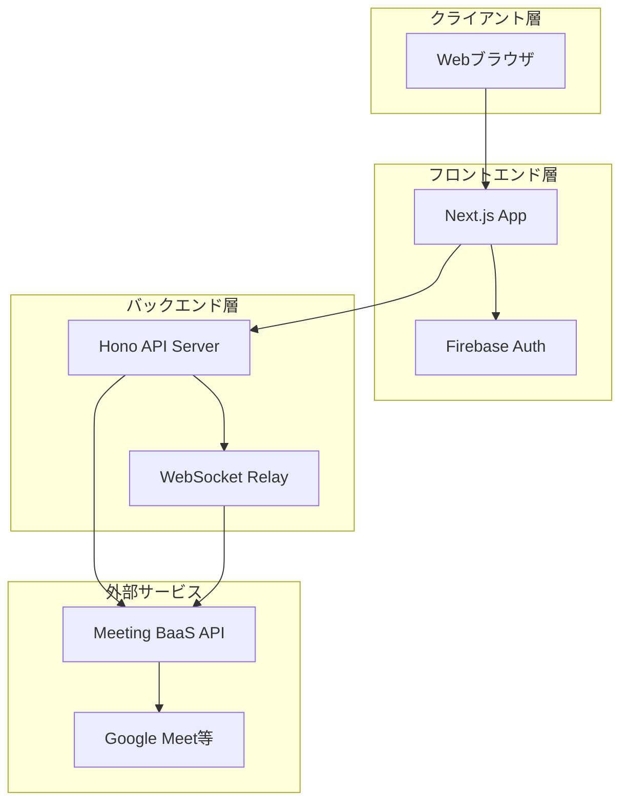
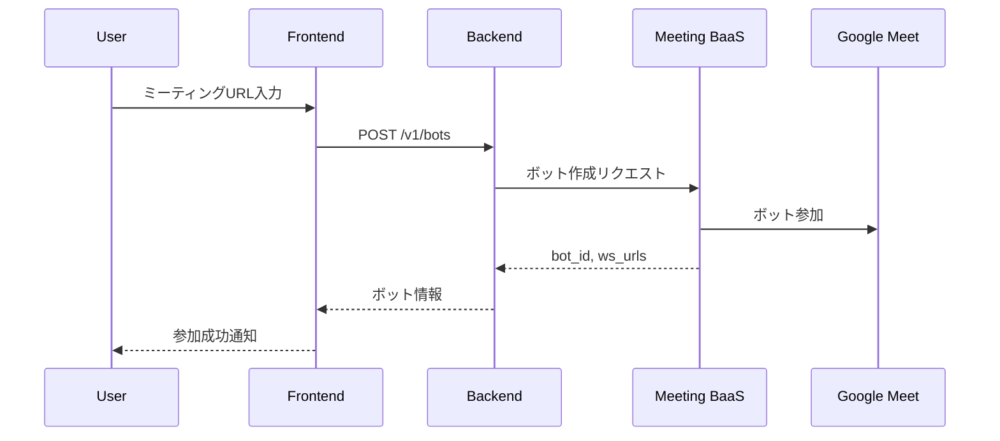
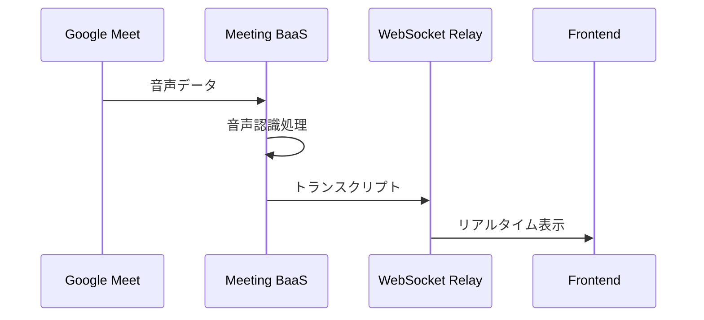

# Yuno アーキテクチャドキュメント

## 目次
1. [システム概要](#システム概要)
2. [アーキテクチャ概要](#アーキテクチャ概要)
3. [技術選定理由](#技術選定理由)
4. [システム構成](#システム構成)
5. [データフロー](#データフロー)
6. [セキュリティ設計](#セキュリティ設計)
7. [スケーラビリティ](#スケーラビリティ)
8. [開発規約](#開発規約)

## システム概要

Yunoは、オンラインミーティングの生産性を向上させるためのAIアシスタントサービスです。Meeting BaaS APIを通じてビデオ会議プラットフォーム（Google Meet等）と統合し、リアルタイムでの文字起こしと議事録作成を提供します。

### 主要コンポーネント



## アーキテクチャ概要

### 全体アーキテクチャパターン

本プロジェクトは以下のアーキテクチャパターンを採用しています：

1. **マイクロサービス指向モノレポ**
   - フロントエンドとバックエンドを独立したサービスとして分離
   - 将来的なマイクロサービス化を見据えた設計

2. **クリーンアーキテクチャ（バックエンド）**
   - ビジネスロジックと外部依存を分離
   - テスタビリティと保守性の向上

3. **JAMstackアーキテクチャ（フロントエンド）**
   - JavaScript (Next.js)
   - APIs (Hono + Firebase)
   - Markup (React Server Components)

## 技術選定理由

### フロントエンド技術スタック

#### Next.js 15 + React 19
- **選定理由**:
  - Server Componentsによるパフォーマンス最適化
  - App Routerによる直感的なルーティング
  - ビルトインの最適化機能（画像、フォント、バンドルサイズ）
  - TypeScriptの第一級サポート

#### Firebase Authentication
- **選定理由**:
  - 信頼性の高い認証基盤
  - Google認証との簡単な統合
  - リアルタイム同期機能
  - セキュアなクライアントサイド認証

#### Tailwind CSS
- **選定理由**:
  - ユーティリティファーストアプローチ
  - 一貫性のあるデザインシステム
  - 高いカスタマイズ性
  - ビルド時の未使用CSSの削除

#### Zustand
- **選定理由**:
  - 軽量な状態管理ライブラリ
  - TypeScript型推論の良好なサポート
  - シンプルなAPI
  - React Suspenseとの互換性

### バックエンド技術スタック

#### Hono
- **選定理由**:
  - 超軽量（~12KB）で高速
  - Web標準APIに準拠
  - TypeScriptファーストな設計
  - Cloudflare Workers等のEdge環境対応

#### WebSocket (ws)
- **選定理由**:
  - Node.js環境での標準的なWebSocket実装
  - 低レイテンシのリアルタイム通信
  - Meeting BaaSとの双方向通信に必須

#### Zod
- **選定理由**:
  - ランタイムでの型検証
  - TypeScript型の自動生成
  - 優れた開発者体験
  - APIリクエスト/レスポンスの検証

## システム構成

### ディレクトリ構造

```
yuno/
├── apps/                    # フロントエンドアプリケーション
│   ├── src/
│   │   ├── app/            # App Routerページ
│   │   ├── features/       # 機能別モジュール
│   │   ├── shared/         # 共通コンポーネント
│   │   └── lib/            # ユーティリティ
│   └── public/             # 静的ファイル
│
├── services/               # バックエンドサービス
│   ├── src/
│   │   ├── clients/        # 外部APIクライアント（アダプター）
│   │   ├── controllers/    # HTTPコントローラー
│   │   ├── routes/         # APIルート定義
│   │   ├── services/       # ビジネスロジック
│   │   └── utils/          # ヘルパー関数
│   └── tests/              # テストファイル
│
└── docs/                   # プロジェクトドキュメント
```

### レイヤード設計（バックエンド）

```
┌─────────────────────────────────────────┐
│         Presentation Layer              │
│  (Routes, Controllers, Middlewares)     │
├─────────────────────────────────────────┤
│         Application Layer               │
│     (Services, Use Cases)               │
├─────────────────────────────────────────┤
│          Domain Layer                   │
│    (Entities, Value Objects)            │
├─────────────────────────────────────────┤
│       Infrastructure Layer              │
│   (Adapters, External APIs)             │
└─────────────────────────────────────────┘
```

## データフロー

### 1. ミーティングボット追加フロー



### 2. リアルタイム文字起こしフロー



## セキュリティ設計

### 認証・認可

1. **フロントエンド認証**
   - Firebase Authenticationによる認証
   - JWTトークンベースのセッション管理
   - NextAuthによる統合

2. **API認証**
   - Bearer tokenによるAPI認証
   - Meeting BaaS APIキーの安全な管理
   - WebSocketのトークンベース認証（オプション）

### セキュリティベストプラクティス

1. **環境変数管理**
   - 機密情報は環境変数で管理
   - `.env`ファイルはgitignore
   - 本番環境では環境変数を適切に設定

2. **CORS設定**
   - 適切なOrigin制限
   - 認証が必要なエンドポイントの保護

3. **入力検証**
   - Zodによる厳密な型検証
   - SQLインジェクション対策（該当する場合）
   - XSS対策

## スケーラビリティ

### 水平スケーリング戦略

1. **ステートレス設計**
   - サーバーサイドでセッション状態を持たない
   - 任意のインスタンスでリクエスト処理可能

2. **キャッシング戦略**
   - CDNによる静的アセットのキャッシュ
   - APIレスポンスの適切なキャッシュヘッダー

3. **負荷分散**
   - ロードバランサーによるトラフィック分散
   - WebSocketの適切なルーティング

### パフォーマンス最適化

1. **フロントエンド最適化**
   - React Server Componentsの活用
   - 画像の最適化とlazy loading
   - コード分割とdynamic imports

2. **バックエンド最適化**
   - Honoの軽量性を活かした高速レスポンス
   - 効率的なWebSocketメッセージ処理
   - 適切なエラーハンドリングとリトライ

## 開発規約

### コーディング標準

1. **TypeScript**
   - strictモードを有効化
   - any型の使用を避ける
   - 適切な型定義とインターフェース

2. **命名規則**
   - コンポーネント: PascalCase
   - 関数・変数: camelCase
   - 定数: UPPER_SNAKE_CASE
   - ファイル名: kebab-case

3. **ディレクトリ構造**
   - 機能別にモジュール化
   - 共通コンポーネントは`shared/`に配置
   - ドメインロジックとインフラストラクチャの分離

### Git規約

1. **ブランチ戦略**
   - main: 本番環境
   - develop: 開発環境
   - feature/*: 機能開発
   - fix/*: バグ修正

2. **コミットメッセージ**
   - 動詞で始める（Add, Update, Fix, Remove）
   - 簡潔で明確な説明
   - 必要に応じて詳細説明を追加

### テスト戦略

1. **単体テスト**
   - ビジネスロジックの網羅的なテスト
   - Jestによる自動化

2. **統合テスト**
   - APIエンドポイントのテスト
   - 外部サービスとの連携テスト

3. **E2Eテスト**
   - 重要なユーザーフローのテスト
   - 本番環境に近い条件でのテスト

## 今後の拡張計画

1. **AI機能の強化**
   - より高度な議事録要約
   - アクションアイテムの自動抽出
   - 参加者の発言分析

2. **マルチプラットフォーム対応**
   - Zoom、Teams等への対応
   - 統一されたAPIインターフェース

3. **エンタープライズ機能**
   - SAML/OIDC認証
   - 監査ログ
   - カスタムブランディング

---

このドキュメントは、プロジェクトの成長と共に更新されます。質問や提案がある場合は、プロジェクトチームまでご連絡ください。