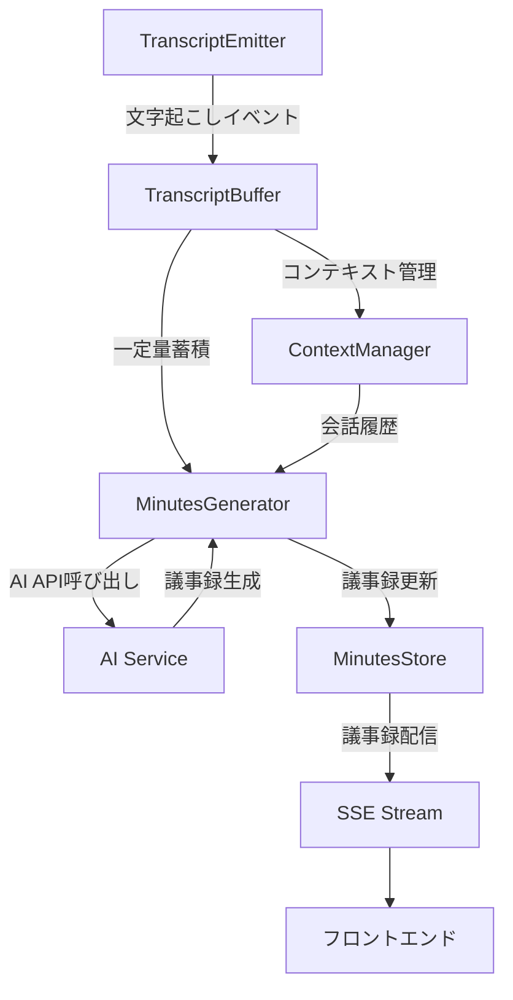

# AI議事録生成機能の実装方針

## 1. 概要

現在のリアルタイム文字起こしシステムに、AI議事録生成機能を統合する実装方針を以下に示します。

## 2. 現状分析

### 現在のデータフロー
```
Meeting BaaS → WebSocket → Gladia API → 文字起こし → SSE → フロントエンド
```

### 新しいデータフロー
```
Meeting BaaS → WebSocket → Gladia API → 文字起こし → AI議事録生成 → SSE → フロントエンド
                                              ↓
                                         バッファリング
                                              ↓
                                         議事録更新
```

## 3. 実装アーキテクチャ

### 3.1 コンポーネント設計



### 3.2 新規実装コンポーネント

#### 1. TranscriptBuffer Service
```typescript
// src/services/transcript-buffer.service.ts
interface TranscriptBuffer {
  meetingId: string;
  segments: TranscriptSegment[];
  lastProcessedAt: Date;
  totalCharacters: number;
}

interface TranscriptSegment {
  text: string;
  timestamp: Date;
  language: string;
  speaker?: string;
}
```

**機能:**
- 文字起こしデータの一時保管
- 処理タイミングの制御（文字数/時間ベース）
- 重複排除とクリーニング

#### 2. Minutes Generator Service
```typescript
// src/services/minutes-generator.service.ts
interface MinutesGenerator {
  generateMinutes(
    newTranscripts: TranscriptSegment[],
    previousMinutes?: Minutes,
    context?: MeetingContext
  ): Promise<Minutes>;
}

interface Minutes {
  meetingId: string;
  summary: string;
  keyPoints: string[];
  actionItems: ActionItem[];
  decisions: Decision[];
  updatedAt: Date;
  version: number;
}
```

**機能:**
- AI APIの呼び出し管理
- プロンプトテンプレート管理
- エラーハンドリングとリトライ
- コスト管理（トークン制限）

#### 3. Context Manager
```typescript
// src/services/context-manager.service.ts
interface MeetingContext {
  meetingId: string;
  participants: string[];
  agenda?: string;
  previousMinutes?: Minutes;
  conversationHistory: ConversationTurn[];
}
```

**機能:**
- 会議のコンテキスト情報管理
- 話者識別（可能な場合）
- 会話履歴の管理

#### 4. Minutes Store
```typescript
// src/services/minutes-store.service.ts
interface MinutesStore {
  save(minutes: Minutes): Promise<void>;
  get(meetingId: string): Promise<Minutes | null>;
  subscribeToUpdates(meetingId: string): AsyncIterable<Minutes>;
}
```

**機能:**
- 議事録の永続化（Redis/Firestore）
- 差分更新の管理
- リアルタイム配信用のPub/Sub

### 3.3 処理フロー

#### バッファリング戦略

```typescript
// 以下の条件のいずれかで議事録生成をトリガー
const TRIGGER_CONDITIONS = {
  // 文字数ベース（500文字以上蓄積）
  CHARACTER_THRESHOLD: 500,
  
  // 時間ベース（最後の処理から30秒経過）
  TIME_INTERVAL_SECONDS: 30,
  
  // 最大待機時間（60秒）
  MAX_WAIT_SECONDS: 60,
  
  // 会話の区切り検出（10秒間の無音）
  SILENCE_THRESHOLD_SECONDS: 10
};
```

#### AI処理の最適化

1. **増分更新方式**
   - 前回の議事録をベースに新しい内容を追加
   - 全体の再生成を避けてレスポンス時間を短縮

2. **並列処理**
   - 複数の会議を並列で処理
   - AI API呼び出しの非同期処理

3. **キャッシング**
   - 同じ内容に対する再処理を避ける
   - 議事録のバージョン管理

## 4. 実装優先順位

### Phase 1: 基本機能（2週間）
1. TranscriptBuffer実装
2. 簡易的なMinutesGenerator（要約のみ）
3. SSE経由での議事録配信
4. 基本的なエラーハンドリング

### Phase 2: 高度な機能（3週間）
1. ContextManager実装
2. 議事録の構造化（アクションアイテム、決定事項）
3. MinutesStore実装（永続化）
4. 差分更新の実装

### Phase 3: 最適化（2週間）
1. 話者識別機能
2. 複数言語対応
3. カスタマイズ可能なプロンプト
4. パフォーマンス最適化

## 5. 技術選択

### AI サービス
**推奨: OpenAI GPT-4 または Claude 3**
- 理由：
  - 高品質な要約生成
  - 構造化出力のサポート
  - 日本語対応
  - ストリーミング対応

### データストア
**推奨: Redis + Cloud Firestore**
- Redis: リアルタイムバッファとPub/Sub
- Firestore: 議事録の永続化

### 実装言語
**TypeScript（既存システムとの統合）**

## 6. 設定・環境変数

```bash
# AI Service
AI_PROVIDER=openai # or anthropic
AI_API_KEY=your-api-key
AI_MODEL=gpt-4-turbo-preview
AI_MAX_TOKENS=2000
AI_TEMPERATURE=0.3

# Buffer Settings
TRANSCRIPT_BUFFER_SIZE=500
TRANSCRIPT_BUFFER_TIMEOUT_SECONDS=30
TRANSCRIPT_MAX_WAIT_SECONDS=60

# Minutes Settings
MINUTES_UPDATE_INTERVAL_SECONDS=30
MINUTES_VERSION_RETENTION_COUNT=10

# Storage
REDIS_URL=redis://localhost:6379
FIRESTORE_PROJECT_ID=your-project-id
```

## 7. API設計の変更

### 既存のSSEイベント
```typescript
// 現在
event: transcript
data: { kind: "transcript", text: "...", lang: "ja", isFinal: true }
```

### 新しいSSEイベント
```typescript
// 議事録更新イベント
event: minutes
data: {
  kind: "minutes",
  summary: "会議の要約...",
  keyPoints: ["重要点1", "重要点2"],
  actionItems: [
    { task: "タスク1", assignee: "担当者", dueDate: "2025-01-20" }
  ],
  decisions: [
    { decision: "決定事項1", rationale: "理由" }
  ],
  version: 5,
  updatedAt: "2025-01-13T10:30:00Z"
}

// 議事録生成状態イベント
event: minutes-status
data: {
  kind: "minutes-status",
  status: "processing", // or "completed", "error"
  message: "議事録を生成中..."
}
```

## 8. エラーハンドリング

### AI APIエラー
- リトライ機構（指数バックオフ）
- フォールバック（簡易要約）
- エラー通知

### バッファオーバーフロー
- 古いデータの自動削除
- 警告ログ
- 自動スケーリング

## 9. モニタリング

### メトリクス
- AI API呼び出し回数・コスト
- 議事録生成の遅延時間
- バッファサイズ
- エラー率

### ログ
- 議事録生成のトリガー
- AI応答時間
- エラー詳細

## 10. セキュリティ考慮事項

- AI APIキーの安全な管理（KMS使用）
- 議事録データの暗号化
- アクセス制御（ユーザー別の議事録）
- PII（個人識別情報）の検出と除去

## 11. テスト戦略

### ユニットテスト
- バッファリングロジック
- 議事録生成ロジック
- エラーハンドリング

### 統合テスト
- End-to-Endのデータフロー
- AI APIモック使用
- 負荷テスト

## 12. 今後の拡張可能性

- カスタムプロンプトテンプレート
- 業界別の議事録フォーマット
- 議事録のエクスポート機能（PDF、Word）
- 過去の議事録検索機能
- 議事録の編集・承認ワークフロー