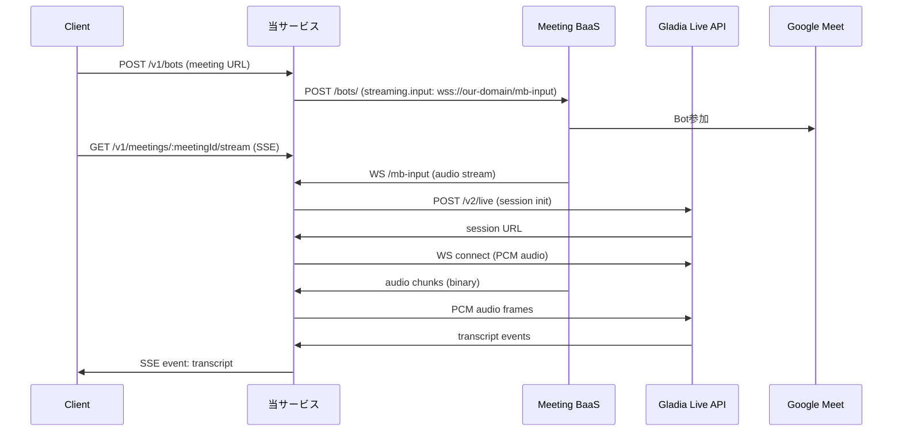

# Meeting BaaS統合実装ガイド

## 0. サマリー

本システムは Meeting BaaS（ミーティング録音・文字起こしサービス）を統合し、Google Meetなどのオンライン会議から音声を取得してリアルタイム文字起こしを提供するサービスです。
Meeting BaaSからWebSocket経由で音声ストリームを受信し、Gladia Live APIに転送して文字起こしを行い、結果をSSE（Server-Sent Events）でクライアントに配信します。

主な特徴：
- ボット管理機能（会議への参加・離脱制御）
- WebSocketリレーによる低遅延音声転送
- 自動再接続機能とバックプレッシャー制御
- 複数言語の自動検出と文字起こし
- モックサーバーによる開発・テスト環境

## 1. システムアーキテクチャ

### 1.1 エントリポイント & ルーティング

* **HTTP/WS サーバ**：`src/index.ts#66-121` - Hono フレームワークとWebSocketServer統合
* **主要エンドポイント**：
  - `POST /v1/bots` - ボットを会議に追加
  - `DELETE /v1/bots/:botId` - ボットを会議から削除
  - `GET /v1/meetings/:meetingId/stream` - SSE形式で文字起こし結果を配信
  - `WS /mb-input` - Meeting BaaSからの音声入力を受信
  - `GET /healthz` - ヘルスチェック（WebSocketリレー統計含む）

### 1.2 データフロー



## 2. コンポーネント詳細

### 2.1 Meeting BaaS アダプター層

#### コアインターフェース (`meetingbaas.client.port.ts`)
ドメイン層が依存する安定したポートインターフェースを提供：
- `addBot`: ミーティングにボットを追加
- `leaveBot`: ミーティングからボットを削除

#### アダプター実装 (`meetingbaas.adapter.v1.ts`)
ベンダー固有のAPIをドメインインターフェースに適合：
- ボット追加時の詳細設定（録音モード、音声認識、自動退出など）
- WebSocketストリーミング設定（16kHz音声）
- 認証ヘッダー管理（`x-meeting-baas-api-key`）
- エラーハンドリングとステータスマッピング
- Idempotency-Key対応による冪等性保証

#### 設定管理 (`meetingbaas.config.ts`)
環境に応じた柔軟な設定：
- APIエンドポイント、タイムアウト設定
- 認証方式（Bearer/カスタムヘッダー）
- ステータスマッピング（ベンダー固有→ドメイン共通）

### 2.2 WebSocketリレーサービス (`ws-relay.service.ts`)

Meeting BaaSからの音声データをGladia Live APIに中継する中核コンポーネント：

#### 主要機能
- **Gladiaセッション管理**: API初期化、WebSocket接続確立
- **音声データ中継**: Meeting BaaS → Gladia への音声転送
- **文字起こし処理**: Gladiaからのtranscriptイベント処理
- **再接続機能**: 指数バックオフによる自動再接続（最大8回）
- **バックプレッシャ管理**: 最大5MBのバッファで古いフレームを自動削除
- **Keep-Alive**: 20秒間隔のping/pongによる接続維持

#### セキュリティ機能
- 認証トークンによる接続制御
- 同一meetingIdの重複接続防止
- センシティブ情報（トークン、APIキー）のマスキング

### 2.3 コントローラー層

#### ボット管理 (`bots.controller.ts`)
- `addBot`: ボット追加API
  - リクエスト検証（meeting URL、user ID）
  - Idempotency-Key対応
  - エラーハンドリング（409 Conflict、503 Service Unavailable）
- `leaveBot`: ボット削除API
  - bot IDによる削除
  - エラーハンドリング（404 Not Found）

#### ストリーミング (`streams.controller.ts`)
- SSE（Server-Sent Events）による文字起こしデータ配信
- WebSocketリレーからのイベントをSSEで配信
- Keep-Alive機能（20秒間隔）
- 大きなイベントデータの自動トランケート（32KB制限）
- クライアント切断時の自動クリーンアップ

### 2.4 サービス層 (`meetingbaas.service.ts`)

- ユーザー別のMeeting BaaSクライアント管理
- 将来的にはKMS（Key Management Service）を使用した暗号化APIキー管理を予定
- 現在は開発用の仮実装（環境変数からAPIキー取得）

## 3. 音声データ仕様

| フロー | エンコーディング | サンプルレート | ビット深度 | チャンネル | 形式/フレーム |
| --- | --- | ---: | ---: | ---: | --- |
| MBaaS → 当方 | Opus/PCM | 16kHz | 16bit | 1 | WebSocket バイナリストリーム |
| 当方 → Gladia | PCM | 16kHz | 16bit | 1 | WebSocket バイナリフレーム |
| 当方 → Client | - | - | - | - | SSE text/event-stream (transcript only) |

### Gladia初期設定
```typescript
{
  encoding: 'wav/pcm',
  sample_rate: 16000,
  bit_depth: 16,
  channels: 1,
  language_behaviour: {
    language_detection: true
  }
}
```

### 文字起こしイベント形式
```typescript
{
  meetingId: string,
  type: 'transcript',
  isFinal: boolean,
  text: string,
  language: string,
  timestamp: string (ISO 8601)
}
```

## 4. モックサーバー実装 (`mocks/meetingbaas/`)

本番APIの代替として使用可能な完全なモックサーバー：

### 機能
- 本番と同じAPIエンドポイント実装
- 複数シナリオ対応（環境変数で切り替え）
- SSEストリーミングのシミュレーション
- Idempotency-Key対応
- 構造化ログ出力

### 利用可能なシナリオ
- `default`: 正常系（全API成功）
- `rate_limit`: 最初のN回は429エラー（レート制限）
- `flaky`: 最初のK回は503エラー（一時的な障害）
- `slow`: 3秒の遅延（タイムアウトテスト）
- `auth_required`: 認証ヘッダー要求

### テストスクリプト
```bash
# ボット追加テスト
npm run test:add-bot

# ボット削除テスト  
npm run test:leave-bot

# エラーシナリオテスト
npm run test:add-bot:errors
```

## 5. 環境変数設定

### 必須設定
```bash
# Google Cloud設定
PROJECT_ID=your-project-id
REGION=asia-northeast1
KMS_KEY_NAME=projects/xxx/locations/xxx/keyRings/xxx/cryptoKeys/xxx

# Meeting BaaS設定
MEETING_BAAS_BASE_URL=https://api.example.com

# Gladia設定（音声認識用）
GLADIA_API_KEY=your-gladia-api-key

# WebSocketリレー設定
PUBLIC_WS_BASE=wss://your-domain.com
WS_RELAY_AUTH_TOKEN=your-secret-token
```

### オプション設定
```bash
# Meeting BaaS詳細設定
MEETING_BAAS_API_VERSION=v1
MEETING_BAAS_AUTH_HEADER=Authorization
MEETING_BAAS_AUTH_SCHEME=Bearer
MEETING_BAAS_TIMEOUT_REQUEST_MS=15000
MEETING_BAAS_TIMEOUT_STREAM_MS=600000

# WebSocketリレー詳細設定
STREAM_RECONNECT_BASE_MS=5000
STREAM_BACKPRESSURE_MAX_BUFFER=5242880

# モックサーバー設定
MOCK_PORT=4010
MOCK_SCENARIO=default
```

## 6. ログ設計

### ログフォーマット
```json
{
  "level": "info",
  "msg": "Opening recording stream",
  "requestId": "550e8400-e29b-41d4-a716-446655440000",
  "service": "cloud-functions",
  "timestamp": "2025-01-09T10:30:00.000Z",
  "meta": {
    "meetingId": "meet123",
    "userId": "user456",
    "mode": "normalized",
    "types": ["audio", "transcript"]
  }
}
```

### 主要ログイベント
- ボット追加/削除の成功/失敗
- WebSocket接続の確立/切断
- 音声ストリーミングの開始/終了
- 文字起こしイベントの受信
- エラーと再接続の試行

## 7. デプロイ・運用

### ローカル開発
```bash
# 開発サーバー起動
npm run dev

# モックサーバーも同時起動
npm run dev:mock

# 本番ビルド＆起動
npm run build && npm start
```

### 本番環境（Cloud Run）
- **ポート**: 環境変数 `PORT` または 3000
- **ヘルスチェック**: `/healthz` エンドポイント
- **WebSocket**: 有効化必要（`/mb-input`パス）
- **タイムアウト**: 15分以上推奨（長時間会議対応）
- **セッションアフィニティ**: 有効化推奨

### Google Cloud Functions対応
- エクスポート名: `helloGET`
- WebSocket非対応のため、SSE配信のみ利用可能

## 8. 信頼性・パフォーマンス

### 再接続ポリシー
- HTTPリクエスト: 2回リトライ、指数バックオフ
- WebSocket接続: 指数バックオフで自動再接続（最大8回）

### バックプレッシャー制御
- 音声バッファサイズ制限（デフォルト5MB）
- バッファオーバー時は古いフレームを自動削除
- ログによる監視とアラート

### スケーラビリティ
- ステートレス設計（セッション情報はメモリ内）
- 水平スケーリング対応（セッションアフィニティ必要）
- Cloud Runの自動スケーリング活用

## 9. セキュリティ考慮事項

### 認証・認可
- Meeting BaaS APIキーによる認証
- WebSocketリレーの認証トークン
- 将来的にKMS統合によるキー管理

### データ保護
- センシティブ情報のマスキング
- HTTPSによる通信暗号化
- 音声データの一時的なメモリ保持のみ

## 10. 既知の課題と改善計画

### 短期的改善
- KMS統合によるAPIキー管理
- メトリクス収集とモニタリング強化
- エラーハンドリングの詳細化

### 中長期的改善
- 音声データのクライアント配信対応
- 複数STTプロバイダー対応
- リアルタイム翻訳機能
- 録音データの永続化オプション

## 11. 参考資料

- [WebSocket Relay Setup Guide](./ws-relay-setup.md)
- [Meeting BaaS API Documentation](https://docs.meetingbaas.com)
- [Gladia Live API Documentation](https://docs.gladia.io)
- [Google Cloud Run WebSocket Support](https://cloud.google.com/run/docs/triggering/websockets)