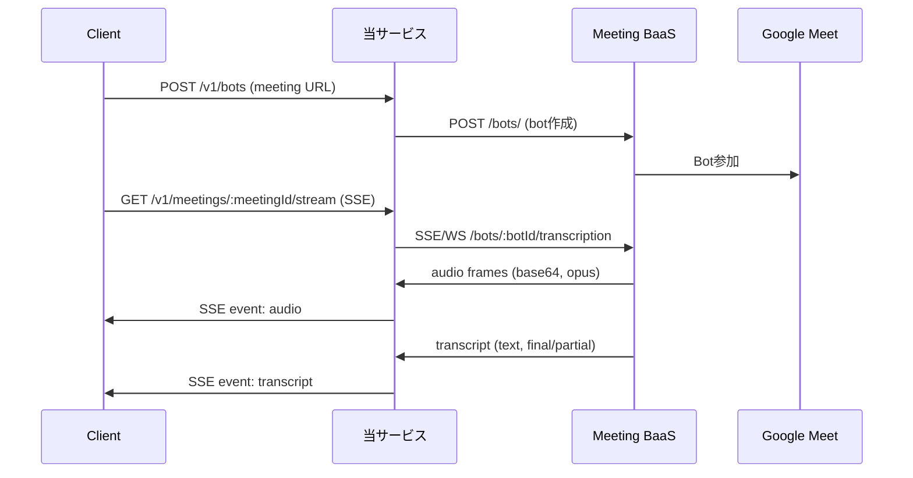
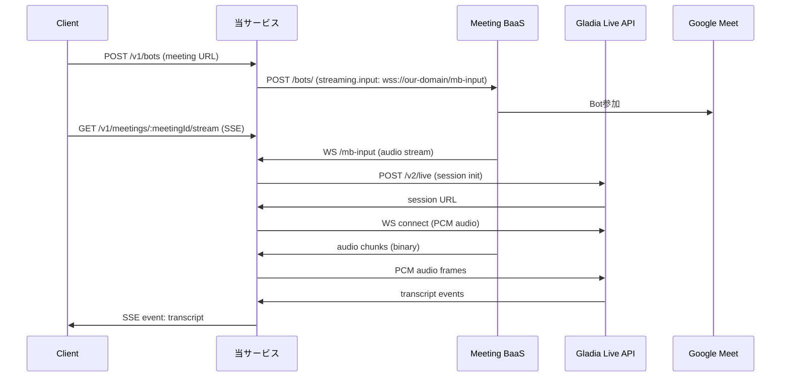

# リアルタイム音声ストリーミング実装監査レポート

## 0. サマリー

現状実装は Meeting BaaS からの音声・トランスクリプトストリームを SSE でクライアントに中継するプロキシとして機能している。
さらに、WebSocket relayモードでは、MBaaSからの音声をGladia Live APIに転送し、リアルタイム文字起こしを行う機能を実装。
音声データは MBaaS から base64 エンコードされた Opus 形式で受信し、Gladia へは PCM形式（16kHz, 16bit, モノラル）で送信。
主な改善点：WebSocket relay実装により再接続機能・バックプレッシャー制御を追加、音声フォーマット仕様の明確化。

## 1. エントリポイント & ルーティング

* **HTTP/WS サーバの実体**：`src/index.ts#66-121` - Hono フレームワークを使用、開発環境では WebSocketServer も統合
* **受け口（MBaas が接続してくる WS パス）一覧**：
  - `/v1/meetings/:meetingId/stream` - SSE ストリーミングエンドポイント（src/controllers/streams.controller.ts#18）
  - `/mb-input` - WebSocket relay モードで MBaaS が音声を送信するパス（src/index.ts#85）
  - 注：SSEモードでは当サービスが MBaas の `/bots/:botId/transcription` に接続する
* **STT 側接続の初期化箇所**：
  - SSEモード：`src/clients/meetingbaas.adapter.v1.ts#51-59` - addBot 内で `speech_to_text.provider: "Default"` を指定
  - WebSocket relayモード：`src/services/ws-relay.service.ts#47-85` - Gladia Live API セッション初期化

## 2. データフロー（Mermaid）

### SSEモード（従来）


### WebSocket Relayモード（新規）


## 3. 音声データ仕様（表）

| フロー | エンコーディング | サンプルレート | ビット深度 | チャンネル | 形式/フレーム |
| --- | --- | ---: | ---: | ---: | --- |
| MBaas → 当方（SSE） | Opus | 不明 | 不明 | 不明 | base64 エンコード文字列 |
| MBaas → 当方（WS） | Opus/PCM | 16kHz | 16bit | 1 | バイナリストリーム |
| 当方 → Gladia | PCM | 16kHz | 16bit | 1 | WebSocket バイナリフレーム |
| 当方 → Client | Opus（パススルー） | 不明 | 不明 | 不明 | SSE data フィールド内 base64 |

* **変換の有無**：
  - SSEモード：なし（src/clients/meetingbaas.adapter.v1.ts#273-299 でバイト配列に変換するが、音声フォーマットの変換はしない）
  - WebSocket relayモード：MBaaSからの音声形式に応じてGladiaへPCM形式で転送（src/services/ws-relay.service.ts#59-62）

## 4. STT 連携

### SSEモード
* **利用プロバイダ／SDK/WS URL**：Meeting BaaS 経由で "Default" プロバイダー（src/clients/meetingbaas.adapter.v1.ts#54）
* **初期メッセージ/メタ送信**：addBot 時に `speech_to_text: { provider: "Default" }` のみ
* **受信イベント処理**：
  ```typescript
  // src/clients/meetingbaas.adapter.v1.ts#305-340
  if (eventType === "transcript" || eventType === "transcription" || eventType === "speech_to_text") {
    const parsed = VendorTranscriptEventSchema.parse(raw);
    return {
      kind: "transcript",
      ts: timestamp,
      text: textFieldValue,
      lang: parsed.lang || parsed.language,
      isFinal: parsed.is_final || parsed.isFinal || parsed.final,
      vendorRaw: raw,
    };
  }
  ```

### WebSocket Relayモード
* **利用プロバイダ／SDK/WS URL**：Gladia Live API v2（https://api.gladia.io/v2/live）
* **初期メッセージ/メタ送信**：
  ```typescript
  // src/services/ws-relay.service.ts#56-66
  {
    encoding: 'wav/pcm',
    sample_rate: 16000,
    bit_depth: 16,
    channels: 1,
    language_behaviour: {
      language_detection: true
    }
  }
  ```
* **受信イベント処理**：
  ```typescript
  // src/services/ws-relay.service.ts#143-165
  if (message.type === 'transcript' && message.data) {
    transcriptEmitter.emit('transcript', {
      meetingId: session.meetingId,
      type: 'transcript',
      isFinal: is_final || false,
      text: transcript || '',
      language: language || 'unknown',
      timestamp: new Date().toISOString()
    });
  }
  ```

## 5. 信頼性（再接続・キュー）

* **再接続ポリシー**：
  - HTTPリクエスト：2回リトライ、指数バックオフ（src/clients/http.client.ts#39-117）
  - SSEモード：ストリーミング接続の再接続なし
  - WebSocket relayモード：指数バックオフで自動再接続（src/services/ws-relay.service.ts#176-212）
* **送信キュー／バッファ**：
  - SSEモード：実装なし
  - WebSocket relayモード：音声キューイング実装あり（src/services/ws-relay.service.ts#217-263）
* **バックプレッシャー制御**：
  - WebSocket relayモード：最大バッファサイズ制限（デフォルト5MB）、古いフレーム自動削除（src/services/ws-relay.service.ts#225-237）
* **既知のボトルネック**：
  - SSEモード：SSE/WSストリーム切断時の再接続機能なし、バックプレッシャー制御なし
  - WebSocket relayモード：大幅に改善済み

## 6. 環境変数

| 環境変数名 | 必須/任意 | デフォルト値 | 参照箇所 |
| --- | --- | --- | --- |
| PROJECT_ID | 必須 | - | src/configs/env.ts#13 |
| REGION | 必須 | - | src/configs/env.ts#14 |
| KMS_KEY_NAME | 必須 | - | src/configs/env.ts#15 |
| MEETING_BAAS_BASE_URL | 必須 | - | src/configs/env.ts#16 |
| MEETING_BAAS_API_VERSION | 任意 | v1 | src/clients/meetingbaas.config.ts#103 |
| MEETING_BAAS_AUTH_HEADER | 任意 | Authorization | src/configs/env.ts#21 |
| MEETING_BAAS_AUTH_SCHEME | 任意 | None | src/configs/env.ts#22 |
| MEETING_BAAS_TIMEOUT_REQUEST_MS | 任意 | 15000 | src/configs/env.ts#23-28 |
| MEETING_BAAS_TIMEOUT_STREAM_MS | 任意 | 600000 | src/configs/env.ts#29-34 |
| MEETING_BAAS_STREAM_PROTOCOL | 任意 | sse | src/configs/env.ts#35 |
| GLADIA_API_KEY | 任意* | - | src/configs/env.ts#38 |
| PUBLIC_WS_BASE | 任意* | - | src/configs/env.ts#39 |
| STREAM_RECONNECT_BASE_MS | 任意 | 5000 | src/configs/env.ts#42-49 |
| STREAM_BACKPRESSURE_MAX_BUFFER | 任意 | 5242880 | src/configs/env.ts#50-57 |

*WebSocket relayモード使用時は必須

## 7. ログ設計

* **ログフォーマット**（src/utils/logger.ts#21-28）：
  ```json
  {
    "level": "info",
    "msg": "Opening recording stream",
    "requestId": "550e8400-e29b-41d4-a716-446655440000",
    "service": "cloud-functions",
    "timestamp": "2025-01-09T10:30:00.000Z",
    "meta": {
      "meetingId": "meet123",
      "userId": "user456",
      "mode": "normalized",
      "types": ["audio", "transcript"]
    }
  }
  ```
* **transcript ログ例**：partial/final の区別は isFinal フィールドで判定可能（src/clients/meetingbaas.adapter.v1.ts#327-334）

## 8. デプロイ/起動

* **ローカル起動**：
  - `npm run dev` - 開発サーバ起動（tsx使用、WebSocketサーバ統合）
  - `npm run dev:mock` - モックサーバも同時起動
  - `npm run build && npm start` - 本番ビルド＆起動
* **本番（Cloud Run 等）**：
  - ポート：環境変数 `PORT` または 3000（src/index.ts#67）
  - ヘルスチェック：`/healthz` エンドポイント（src/routes/_router.ts#11-28）
  - WebSocket：WebSocket relayモード使用時は有効化必要（/mb-inputパス）
  - エクスポート名：`helloGET`（Google Cloud Functions用）

## 9. 既知の不整合・改善候補（箇条書き）

### SSEモード固有の問題
* **音声仕様不明**：MBaas の音声フォーマット（サンプリングレート、ビット深度、チャンネル数）が不明確
* **再接続機能なし**：ストリーミング接続切断時の自動再接続がない
* **バックプレッシャなし**：クライアントが遅い場合のフロー制御がない
* **エラーハンドリング不足**：ストリーム中のエラー時にクライアントへの通知のみで復旧試行なし

### 共通の問題
* **認証の一貫性**：Bearer認証とカスタムヘッダー（x-meeting-baas-api-key）の混在
* **ストリーミングパスの不一致**：設定では `/bots/:botId/transcription` だが、実際の利用では meetingId を使用
* **タイムアウト設定**：600秒のストリームタイムアウトが長時間会議に不十分な可能性
* **セキュリティ**：APIキーが環境変数で直接管理されKMSなどでの暗号化なし

### WebSocket relayモードで改善済み
* ✅ **音声仕様明確化**：Gladia APIへPCM 16kHz/16bit/モノラルで送信
* ✅ **自動再接続**：指数バックオフによる再接続機能実装
* ✅ **バックプレッシャー制御**：音声キューイングと古いフレームの自動削除
* ✅ **エラーハンドリング改善**：接続エラー時の自動復旧機能

## 10. 変更対象候補ファイル（一覧）

### 既存ファイル（SSEモード）
* `src/clients/meetingbaas.adapter.v1.ts` - ストリーミング接続・音声データ処理の中核実装
* `src/clients/http.client.ts` - WebSocket/SSEクライアント実装（再接続機能追加候補）
* `src/controllers/streams.controller.ts` - SSEストリーミングコントローラー（WebSocket relay統合済み）
* `src/clients/meetingbaas.config.ts` - Meeting BaaS設定（音声仕様の明確化）
* `src/schemas/vendor/meetingbaas.v1.ts` - ベンダーイベントスキーマ（音声フォーマット情報追加）

### 新規追加ファイル（WebSocket relayモード）
* `src/services/ws-relay.service.ts` - WebSocket relay実装（MBaaS→Gladia中継）
* `src/realtime/ws-relay.ts` - WebSocket relayのエクスポート用エントリポイント
* `docs/ws-relay-setup.md` - WebSocket relayセットアップガイド