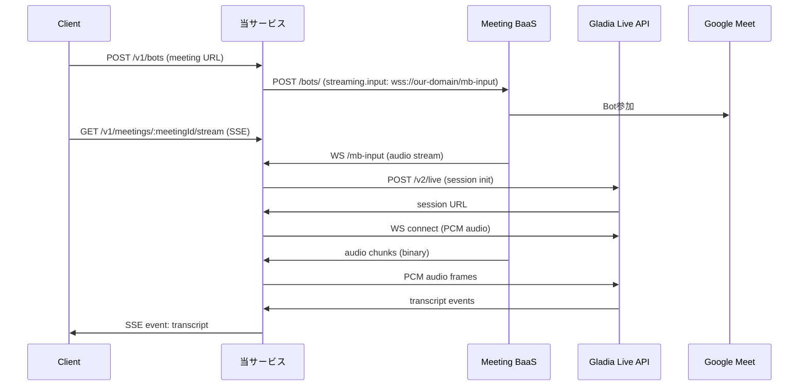

# リアルタイム音声ストリーミング実装監査レポート

## 0. サマリー

現状実装は Meeting BaaS からの音声ストリームをWebSocket経由で受信し、Gladia Live APIに転送してリアルタイム文字起こしを行うシステム。
音声データは MBaaS からバイナリストリームで受信し、Gladia へは PCM形式（16kHz, 16bit, モノラル）で送信。
主な特徴：自動再接続機能、バックプレッシャー制御、音声キューイング、複数言語自動検出。

## 1. エントリポイント & ルーティング

* **HTTP/WS サーバの実体**：`src/index.ts#66-121` - Hono フレームワークを使用、WebSocketServer 統合
* **受け口（MBaas が接続してくる WS パス）一覧**：
  - `/v1/meetings/:meetingId/stream` - SSE形式でクライアントにトランスクリプトを配信（src/controllers/streams.controller.ts#4）
  - `/mb-input` - MBaaS が音声を送信するWebSocketパス（src/index.ts#85）
* **STT 側接続の初期化箇所**：`src/services/ws-relay.service.ts#47-85` - Gladia Live API セッション初期化

## 2. データフロー（Mermaid）


## 3. 音声データ仕様（表）

| フロー | エンコーディング | サンプルレート | ビット深度 | チャンネル | 形式/フレーム |
| --- | --- | ---: | ---: | ---: | --- |
| MBaas → 当方 | Opus/PCM | 16kHz | 16bit | 1 | WebSocket バイナリストリーム |
| 当方 → Gladia | PCM | 16kHz | 16bit | 1 | WebSocket バイナリフレーム |
| 当方 → Client | - | - | - | - | SSE text/event-stream (transcript only) |

* **変換の有無**：MBaaSからの音声形式に応じてGladiaへPCM形式で転送（src/services/ws-relay.service.ts#59-62）

## 4. STT 連携
* **利用プロバイダ／SDK/WS URL**：Gladia Live API v2（https://api.gladia.io/v2/live）
* **初期メッセージ/メタ送信**：
  ```typescript
  // src/services/ws-relay.service.ts#56-66
  {
    encoding: 'wav/pcm',
    sample_rate: 16000,
    bit_depth: 16,
    channels: 1,
    language_behaviour: {
      language_detection: true
    }
  }
  ```
* **受信イベント処理**：
  ```typescript
  // src/services/ws-relay.service.ts#143-165
  if (message.type === 'transcript' && message.data) {
    transcriptEmitter.emit('transcript', {
      meetingId: session.meetingId,
      type: 'transcript',
      isFinal: is_final || false,
      text: transcript || '',
      language: language || 'unknown',
      timestamp: new Date().toISOString()
    });
  }
  ```

## 5. 信頼性（再接続・キュー）

* **再接続ポリシー**：
  - HTTPリクエスト：2回リトライ、指数バックオフ（src/clients/http.client.ts#39-117）
  - WebSocket接続：指数バックオフで自動再接続（src/services/ws-relay.service.ts#176-212）
* **送信キュー／バッファ**：音声キューイング実装あり（src/services/ws-relay.service.ts#217-263）
* **バックプレッシャー制御**：最大バッファサイズ制限（デフォルト5MB）、古いフレーム自動削除（src/services/ws-relay.service.ts#225-237）
* **既知のボトルネック**：なし（自動再接続、バックプレッシャー制御により安定稼働）

## 6. 環境変数

| 環境変数名 | 必須/任意 | デフォルト値 | 参照箇所 |
| --- | --- | --- | --- |
| PROJECT_ID | 必須 | - | src/configs/env.ts#13 |
| REGION | 必須 | - | src/configs/env.ts#14 |
| KMS_KEY_NAME | 必須 | - | src/configs/env.ts#15 |
| MEETING_BAAS_BASE_URL | 必須 | - | src/configs/env.ts#16 |
| MEETING_BAAS_API_VERSION | 任意 | v1 | src/clients/meetingbaas.config.ts#100 |
| MEETING_BAAS_AUTH_HEADER | 任意 | Authorization | src/configs/env.ts#21 |
| MEETING_BAAS_AUTH_SCHEME | 任意 | None | src/configs/env.ts#22 |
| MEETING_BAAS_TIMEOUT_REQUEST_MS | 任意 | 15000 | src/configs/env.ts#23-28 |
| MEETING_BAAS_TIMEOUT_STREAM_MS | 任意 | 600000 | src/configs/env.ts#29-34 |
| GLADIA_API_KEY | 必須 | - | src/configs/env.ts#36 |
| PUBLIC_WS_BASE | 必須 | - | src/configs/env.ts#37 |
| STREAM_RECONNECT_BASE_MS | 任意 | 5000 | src/configs/env.ts#40-49 |
| STREAM_BACKPRESSURE_MAX_BUFFER | 任意 | 5242880 | src/configs/env.ts#50-57 |

## 7. ログ設計

* **ログフォーマット**（src/utils/logger.ts#21-28）：
  ```json
  {
    "level": "info",
    "msg": "Opening recording stream",
    "requestId": "550e8400-e29b-41d4-a716-446655440000",
    "service": "cloud-functions",
    "timestamp": "2025-01-09T10:30:00.000Z",
    "meta": {
      "meetingId": "meet123",
      "userId": "user456",
      "mode": "normalized",
      "types": ["audio", "transcript"]
    }
  }
  ```
* **transcript ログ例**：partial/final の区別は isFinal フィールドで判定可能（src/clients/meetingbaas.adapter.v1.ts#327-334）

## 8. デプロイ/起動

* **ローカル起動**：
  - `npm run dev` - 開発サーバ起動（tsx使用、WebSocketサーバ統合）
  - `npm run dev:mock` - モックサーバも同時起動
  - `npm run build && npm start` - 本番ビルド＆起動
* **本番（Cloud Run 等）**：
  - ポート：環境変数 `PORT` または 3000（src/index.ts#67）
  - ヘルスチェック：`/healthz` エンドポイント（src/routes/_router.ts#11-28）
  - WebSocket：有効化必要（/mb-inputパス）
  - エクスポート名：`helloGET`（Google Cloud Functions用）

## 9. 既知の不整合・改善候補（箇条書き）

* **認証の一貫性**：Bearer認証とカスタムヘッダーの混在（将来的にkey-store統合で解決予定）
* **タイムアウト設定**：600秒のストリームタイムアウトが長時間会議に不十分な可能性
* **セキュリティ**：APIキーが環境変数で直接管理（KMS統合予定）
* **音声のみ対応**：現在はトランスクリプトのみクライアントに配信、音声データの転送は未実装

## 10. 変更対象候補ファイル（一覧）

* `src/clients/meetingbaas.adapter.v1.ts` - Meeting BaaS API クライアント（ボット追加・削除）
* `src/clients/http.client.ts` - HTTPクライアント実装
* `src/controllers/streams.controller.ts` - SSE配信コントローラー（クライアント向け）
* `src/services/ws-relay.service.ts` - WebSocket relay実装（MBaaS→Gladia中継）
* `src/index.ts` - WebSocketサーバー統合
* `docs/ws-relay-setup.md` - WebSocket relayセットアップガイド