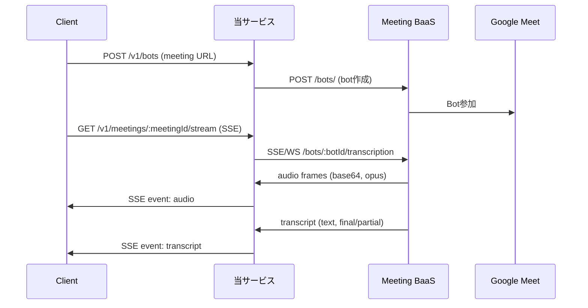

# リアルタイム音声ストリーミング実装監査レポート

## 0. サマリー

現状実装は Meeting BaaS からの音声・トランスクリプトストリームを SSE でクライアントに中継するプロキシとして機能している。
音声データは base64 エンコードされた Opus 形式で転送されるが、具体的なサンプリングレート・ビット深度の仕様は明示されていない。
主な懸念点：ストリーミング接続の再接続機能なし、バックプレッシャ制御なし、音声フォーマット仕様の不明確さ。

## 1. エントリポイント & ルーティング

* **HTTP/WS サーバの実体**：`src/index.ts#66-84` - Hono フレームワークを使用、開発環境では `@hono/node-server` で起動
* **受け口（MBaas が接続してくる WS パス）一覧**：
  - `/v1/meetings/:meetingId/stream` - SSE ストリーミングエンドポイント（src/routes/streams.recording.ts#8-13）
  - 注：現実装では MBaas は当サービスに接続しない。当サービスが MBaas の `/bots/:botId/transcription` に接続する
* **STT 側接続の初期化箇所**：`src/clients/meetingbaas.adapter.v1.ts#51-59` - addBot メソッド内で `speech_to_text.provider: "Default"` を指定

## 2. データフロー（Mermaid）



## 3. 音声データ仕様（表）

| フロー | エンコーディング | サンプルレート | ビット深度 | チャンネル | 形式/フレーム |
| --- | --- | ---: | ---: | ---: | --- |
| MBaas → 当方 | Opus | 不明 | 不明 | 不明 | base64 エンコード文字列 |
| 当方 → Client | Opus（パススルー） | 不明 | 不明 | 不明 | SSE data フィールド内 base64 |

* **変換の有無**：なし（src/clients/meetingbaas.adapter.v1.ts#273-299 でバイト配列に変換するが、音声フォーマットの変換はしない）

## 4. STT 連携

* **利用プロバイダ／SDK/WS URL**：Meeting BaaS 経由で "Default" プロバイダー（src/clients/meetingbaas.adapter.v1.ts#54）
* **初期メッセージ/メタ送信**：addBot 時に `speech_to_text: { provider: "Default" }` のみ
* **受信イベント処理**：
  ```typescript
  // src/clients/meetingbaas.adapter.v1.ts#305-340
  if (eventType === "transcript" || eventType === "transcription" || eventType === "speech_to_text") {
    const parsed = VendorTranscriptEventSchema.parse(raw);
    return {
      kind: "transcript",
      ts: timestamp,
      text: textFieldValue,
      lang: parsed.lang || parsed.language,
      isFinal: parsed.is_final || parsed.isFinal || parsed.final,
      vendorRaw: raw,
    };
  }
  ```

## 5. 信頼性（再接続・キュー）

* **再接続ポリシー**：
  - HTTPリクエスト：2回リトライ、指数バックオフ（src/clients/http.client.ts#39-117）
  - ストリーミング接続：再接続なし
* **送信キュー／バッファ**：実装なし
* **既知のボトルネック**：
  - SSE/WSストリーム切断時の再接続機能なし
  - クライアントへの送信バックプレッシャ制御なし

## 6. 環境変数

| 環境変数名 | 必須/任意 | デフォルト値 | 参照箇所 |
| --- | --- | --- | --- |
| PROJECT_ID | 必須 | - | src/configs/env.ts#13 |
| REGION | 必須 | - | src/configs/env.ts#14 |
| KMS_KEY_NAME | 必須 | - | src/configs/env.ts#15 |
| MEETING_BAAS_BASE_URL | 必須 | - | src/configs/env.ts#16 |
| MEETING_BAAS_API_VERSION | 任意 | v1 | src/clients/meetingbaas.config.ts#103 |
| MEETING_BAAS_AUTH_HEADER | 任意 | x-meeting-baas-api-key | src/clients/meetingbaas.config.ts#101 |
| MEETING_BAAS_AUTH_SCHEME | 任意 | None | src/clients/meetingbaas.config.ts#102 |
| MEETING_BAAS_TIMEOUT_REQUEST_MS | 任意 | 15000 | src/clients/meetingbaas.config.ts#115 |
| MEETING_BAAS_TIMEOUT_STREAM_MS | 任意 | 600000 | src/clients/meetingbaas.config.ts#116 |
| MEETING_BAAS_STREAM_PROTOCOL | 任意 | sse | src/clients/meetingbaas.config.ts#104 |

## 7. ログ設計

* **ログフォーマット**（src/utils/logger.ts#21-28）：
  ```json
  {
    "level": "info",
    "msg": "Opening recording stream",
    "requestId": "550e8400-e29b-41d4-a716-446655440000",
    "service": "cloud-functions",
    "timestamp": "2025-01-09T10:30:00.000Z",
    "meta": {
      "meetingId": "meet123",
      "userId": "user456",
      "mode": "normalized",
      "types": ["audio", "transcript"]
    }
  }
  ```
* **transcript ログ例**：partial/final の区別は isFinal フィールドで判定可能（src/clients/meetingbaas.adapter.v1.ts#327-334）

## 8. デプロイ/起動

* **ローカル起動**：
  - `npm run dev` - 開発サーバ起動（tsx使用）
  - `npm run dev:mock` - モックサーバも同時起動
  - `npm run build && npm start` - 本番ビルド＆起動
* **本番（Cloud Run 等）**：
  - ポート：環境変数 `PORT` または 3000（src/index.ts#67）
  - ヘルスチェック：`/healthz` エンドポイント（src/routes/_router.ts#10-12）
  - WebSocket：SSEを使用しているため特別な設定不要
  - エクスポート名：`helloGET`（Google Cloud Functions用）

## 9. 既知の不整合・改善候補（箇条書き）

* **音声仕様不明**：MBaas の音声フォーマット（サンプリングレート、ビット深度、チャンネル数）が不明確
* **再接続機能なし**：ストリーミング接続切断時の自動再接続がない
* **バックプレッシャなし**：クライアントが遅い場合のフロー制御がない
* **エラーハンドリング不足**：ストリーム中のエラー時にクライアントへの通知のみで復旧試行なし
* **認証の一貫性**：Bearer認証とカスタムヘッダー（x-meeting-baas-api-key）の混在
* **ストリーミングパスの不一致**：設定では `/bots/:botId/transcription` だが、実際の利用では meetingId を使用
* **タイムアウト設定**：600秒のストリームタイムアウトが長時間会議に不十分な可能性
* **セキュリティ**：APIキーが環境変数で直接管理されKMSなどでの暗号化なし

## 10. 変更対象候補ファイル（一覧）

* `src/clients/meetingbaas.adapter.v1.ts` - ストリーミング接続・音声データ処理の中核実装
* `src/clients/http.client.ts` - WebSocket/SSEクライアント実装（再接続機能追加候補）
* `src/controllers/streams.controller.ts` - SSEストリーミングコントローラー（バックプレッシャ実装候補）
* `src/clients/meetingbaas.config.ts` - Meeting BaaS設定（音声仕様の明確化）
* `src/schemas/vendor/meetingbaas.v1.ts` - ベンダーイベントスキーマ（音声フォーマット情報追加）